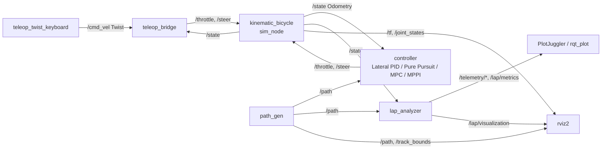
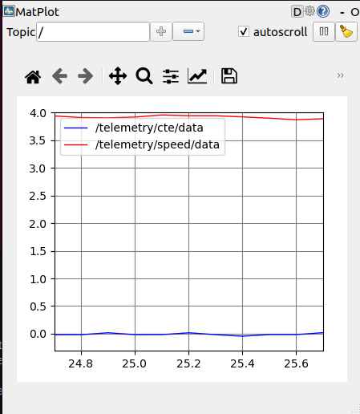
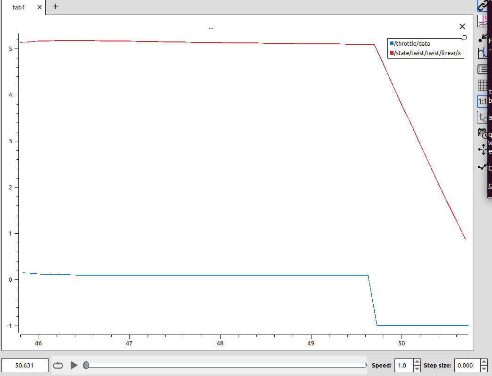
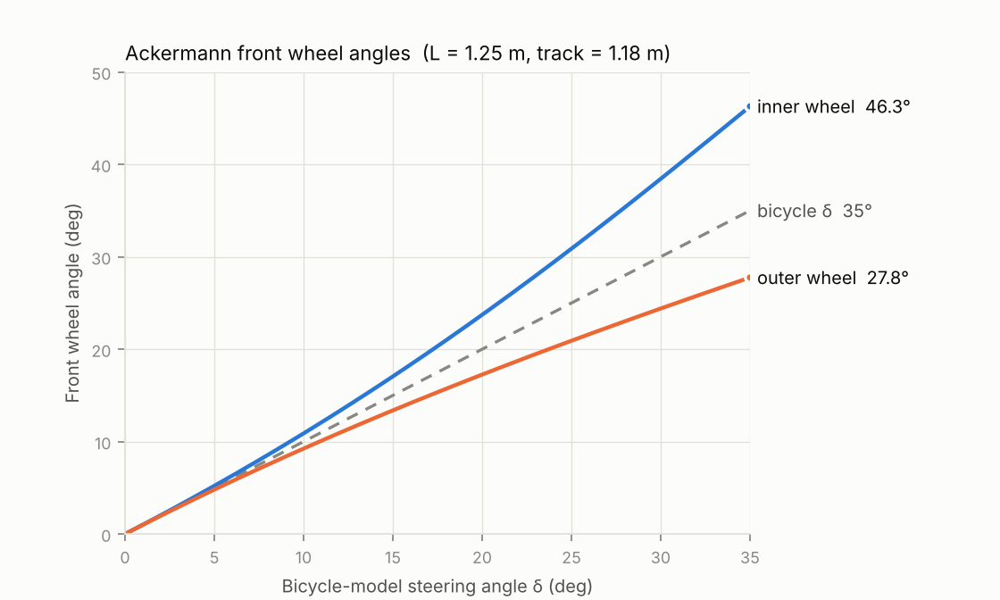
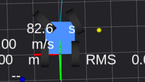
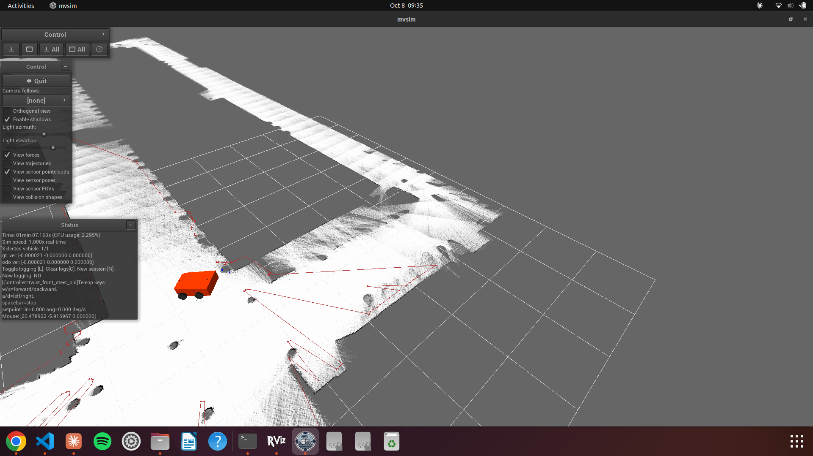

# Bicycle Gym — Autonomous Racing Control in ROS 2

**Autotronics Research Lab (ARL) — Ain Shams University**
Course: Autonomous Vehicles & Drive-by-Wire Systems · Individual project

| | |
|---|---|
| **Student** | Ali Amr |
| **Student ID** | 24P0312 |
| **Programme** | Computer and Artificial Intelligence Engineering (CAIE) |
| **GitHub** | [ali4mr/Control_Project](https://github.com/ali4mr/Control_Project) |
| **Stack** | Ubuntu 22.04 · ROS 2 Humble · Python 3.10 · NumPy · SciPy |

A simulated car drives a 528 m closed racetrack in ROS 2. I implemented the vehicle physics, a keyboard
drive-by-wire bridge, a cruise controller, a curvature-based speed profiler, three lateral controllers
(Lateral PID, Pure Pursuit, MPC), a lap analyzer with live telemetry, and — for Milestone 6 — Ackermann
kinematics, a 3D-simulator comparison (MVSim) and a sampling-based MPPI controller.

---

## Contents

1. [System architecture](#1-system-architecture)
2. [Vehicle model (M2)](#2-vehicle-model-milestone-2)
3. [Teleoperation bridge (M3)](#3-teleoperation-bridge-milestone-3)
4. [Longitudinal PID cruise control (M4)](#4-longitudinal-pid-cruise-control-milestone-4)
5. [Velocity profiler (M5.1)](#5-velocity-profiler-milestone-51)
6. [Lateral PID (M5.2)](#6-lateral-pid-milestone-52)
7. [Pure Pursuit (M5.3)](#7-pure-pursuit-milestone-53)
8. [Extended kinematic MPC (M5.4)](#8-extended-kinematic-mpc-milestone-54)
9. [Lap analyzer and telemetry (M5.5)](#9-lap-analyzer-and-telemetry-milestone-55)
10. [Benchmark results](#10-benchmark-results)
11. [Critical comparison](#11-critical-comparison)
12. [Why MPC tracks better than Pure Pursuit and Lateral PID](#12-why-mpc-tracks-better-than-pure-pursuit-and-lateral-pid)
13. [Milestone 6 — Free exploration](#13-milestone-6--free-exploration)
14. [Reproduction guide](#14-reproduction-guide)
15. [Repository layout and changes](#15-repository-layout-and-changes)

---

## 1. System architecture

Three ROS 2 Python packages:

| Package | Responsibility |
|---|---|
| `bicycle_sim` | Vehicle model and simulator node, URDF/Xacro, RViz config, launch files |
| `bicycle_control` | Teleop bridge, longitudinal PID, velocity profiler, Lateral PID, Pure Pursuit, MPC, MPPI, controller node |
| `track_environment` | Track loading, path publishing, boundary cones, lap analyzer |



Only one source drives the car at a time: either `teleop_bridge` (manual / cruise) or `controller` (autonomous).

### Topics, types and units (Milestone 1)

Discovered with `ros2 node list`, `ros2 topic list -t`, `ros2 topic info -v` and `ros2 interface show`.

| Topic | Type | Publisher | Subscriber(s) | Meaning | Unit / range |
|---|---|---|---|---|---|
| `/throttle` | `std_msgs/Float32` | teleop_bridge or controller | kinematic_bicycle | throttle / brake effort | [−1, 1], −1 full brake, +1 full throttle |
| `/steer` | `std_msgs/Float32` | teleop_bridge or controller | kinematic_bicycle | front steering angle | rad, + = left, limited to ±35° |
| `/state` | `nav_msgs/Odometry` | kinematic_bicycle | controller, lap_analyzer, teleop_bridge | rear-axle pose and speed | x, y in m; heading as quaternion; speed in m/s |
| `/path` | `nav_msgs/Path` | path_gen | controller, lap_analyzer, rviz2 | track centreline (1,000 waypoints, ≈528.2 m) | m |
| `/cmd_vel` | `geometry_msgs/Twist` | teleop_twist_keyboard | teleop_bridge | driver command | linear.x in m/s, angular.z in rad/s |
| `/telemetry/cte` | `std_msgs/Float32` | lap_analyzer | plot tools | signed cross-track error | m, + = left of path |
| `/telemetry/heading_err_deg` | `std_msgs/Float32` | lap_analyzer | plot tools | car heading − path heading | deg |
| `/telemetry/speed` | `std_msgs/Float32` | lap_analyzer | plot tools | forward speed | m/s |
| `/telemetry/lap_time` | `std_msgs/Float32` | lap_analyzer | plot tools | time of current lap | s |
| `/lap/metrics` | `std_msgs/String` | lap_analyzer | — | JSON summary of all metrics | — |
| `/lap/visualization` | `visualization_msgs/MarkerArray` | lap_analyzer | rviz2 | start gate, CTE whisker, HUD | — |

Live signals were plotted with **PlotJuggler** and **rqt_plot**:



---

## 2. Vehicle model (Milestone 2)

`bicycle_sim/bicycle_sim/bicycle_model.py`

The car is an **extended kinematic bicycle model**: both front wheels are lumped into one steered wheel and both
rear wheels into one driven wheel, tyres do not slip, and — unlike the basic model — **speed is a state**, driven by
throttle and slowed by drag and rolling resistance.

State $\mathbf{x} = [x,\ y,\ \theta,\ v]$ (rear-axle position, heading, speed). Inputs $\mathbf{u} = [u,\ \delta]$ (throttle, steering).

$$
\dot x = v\cos\theta,\qquad
\dot y = v\sin\theta,\qquad
\dot\theta = \frac{v}{L}\tan\delta,\qquad
\dot v = k_a\,u - \left(c_{drag}\,v^2 + c_{roll}\,v\right)
$$

with $L = 1.25$ m, $k_a = 4.0$ m/s², $c_{drag} = 0.005$, $c_{roll} = 0.05$.

**Forward Euler integration** at $\Delta t = 0.1$ s, followed by two physical constraints:

$$
\mathbf{x}_{k+1} = \mathbf{x}_k + \dot{\mathbf{x}}_k\,\Delta t,\qquad
\theta \leftarrow \operatorname{atan2}(\sin\theta,\cos\theta),\qquad
v \leftarrow \operatorname{clip}(v,\ 0,\ 25)
$$

- **Heading wrapping** keeps $\theta \in [-\pi, \pi]$. Without it, $\theta$ grows without bound on a closed track and any
  controller that subtracts angles sees false errors of $2\pi$.
- **Speed clamping**: braking (negative throttle) decelerates the car but cannot reverse it; the top speed is 25 m/s.

**Verification.** All four unit tests in `test_bicycle_model.py` pass. With a constant $u = 0.5$, $\dot v = 0$ when
$2.0 = 0.005v^2 + 0.05v$, giving a terminal speed of **15.6 m/s**, which matched the plotted speed. A constant
$\delta = 0.3$ rad produces a circle of radius $R = L/\tan\delta \approx 4$ m.

**Assumptions and limits.** No tyre slip, no load transfer, no yaw inertia. The model is accurate at moderate speeds but
overestimates grip in fast corners, which is why the velocity profiler (Section 5) limits lateral acceleration.

---

## 3. Teleoperation bridge (Milestone 3)

`bicycle_control/bicycle_control/teleop_bridge.py`

Translates the standard `geometry_msgs/Twist` from `teleop_twist_keyboard` into drive-by-wire commands with an
**open-loop mapping**:

$$
u = \operatorname{clip}\!\left(\frac{v_{cmd}}{v_{max}},\,-1,\,1\right),\qquad
\delta = \operatorname{clip}\!\left(\frac{\omega_{cmd}}{\omega_{max}},\,-1,\,1\right)\delta_{max}
$$

with $v_{max} = 5$ m/s, $\omega_{max} = 1$ rad/s, $\delta_{max} = 35° = 0.611$ rad.

**Safety watchdog.** Commands are published at 10 Hz. If no `/cmd_vel` message arrives for **0.5 s**, throttle and
steering are set to zero (and, in cruise mode, the target speed to zero), so a lost keyboard or crashed node cannot
leave the car running away.

---

## 4. Longitudinal PID cruise control (Milestone 4)

`bicycle_control/bicycle_control/longitudinal_pid.py`

Because speed is a state with drag, a fixed throttle does not give a fixed speed. A PID closes the loop:

$$
e = v_{target} - v,\qquad
u = K_p\,e + K_i \int e\,dt + K_d\,\frac{de}{dt},\qquad K_p = 1.0,\ K_i = 0.2,\ K_d = 0.05
$$

**Anti-windup by clamping.** The integral is clamped to $\pm 2$ and the output clipped to $[-1, 1]$. Without the clamp the
integral keeps growing while the actuator is saturated and causes large overshoot once the car catches up.

**Cruise integration.** With `use_cruise_control:=true`, the teleop bridge treats `linear.x` as a target speed, subscribes
to `/state`, and lets the PID choose the throttle every 0.1 s.

**Observed (target 5 m/s).** The plot shows the last seconds of the hold phase and the release (red: speed, blue: throttle):



- Speed rises to and holds ≈ 5 m/s (a small overshoot of ≈ 0.15 m/s decays slowly). At steady state the throttle stays at ≈ 0.1 > 0:
  the integral term supplies exactly the throttle needed to cancel drag. A P-only controller would settle below the target (steady-state error).
- On key release the watchdog sets the target to 0; the error jumps to −5 m/s, so the PID saturates at full brake (throttle −1) and the car stops quickly.
- At standstill the throttle rests at −0.4 = $K_i \times (-2)$: the integral sits at its anti-windup limit instead of
  growing without bound.

---

## 5. Velocity profiler (Milestone 5.1)

`bicycle_control/bicycle_control/velocity_profiler.py`

**Curvature.** For the waypoint nearest the car (or the Pure Pursuit target), curvature is estimated from the change in path
heading over the distance between its neighbours:

$$
\kappa \approx \frac{\Delta\psi}{\Delta s} = \frac{\operatorname{wrap}(\psi_{i+1} - \psi_{i-1})}{\lVert p_{i+1} - p_{i-1}\rVert}
$$

**Speed limit.** Lateral acceleration in a bend is $a_{lat} = v^2\kappa$. Limiting it to $a_{max} = 5$ m/s²:

$$
v_{target} = \min\!\left(\sqrt{\frac{a_{max}}{|\kappa|}},\ v_{max}\right),\qquad v_{max} = 7.5 \text{ m/s}
$$

with $v_{target} = v_{max}$ when $|\kappa| < 10^{-6}$ (straight). Example: $R = 5$ m → $\kappa = 0.2$ → $v = 5$ m/s.
The longitudinal PID then tracks $v_{target}$.

---

## 6. Lateral PID (Milestone 5.2)

`bicycle_control/bicycle_control/lateral_pid.py`

A reactive controller on the signed cross-track error $e_y$ (positive = car left of path) and heading error
$e_\psi = \psi_{car} - \psi_{path}$ (positive = car pointing left of the path):

$$
\delta = -\left(K_p\,e_y + K_i \int e_y\,dt + K_d\,\frac{de_y}{dt}\right) - K_\psi\,e_\psi,
\qquad K_p = 0.8,\ K_i = 0.02,\ K_d = 0.15,\ K_\psi = 0.5
$$

**Sign convention.** The minus signs steer *against* the error: left of the path → $\delta < 0$ (steer right), right of the
path → $\delta > 0$ (steer left). Both unit tests check this. The integral is clamped to $\pm 1$ (anti-windup) and the output
to ±35°.

---

## 7. Pure Pursuit (Milestone 5.3)

`bicycle_control/bicycle_control/pure_pursuit.py`

A geometric controller that steers the rear axle onto the circular arc passing through a look-ahead point on the path.

1. **Adaptive look-ahead:** $L_d = \operatorname{clip}(k_v v + L_{min},\ L_{min},\ L_{max})$ with $k_v = 0.25$, $L_{min} = 0.8$ m, $L_{max} = 2.5$ m.
   Faster driving looks further ahead and turns more smoothly; too short a look-ahead zig-zags, too long cuts corners.
2. **Target selection:** from the nearest waypoint, walk forward to the first waypoint at least $L_d$ from the car.
3. **Transform to the vehicle frame:**
   $x_c = \cos\theta\,\Delta x + \sin\theta\,\Delta y,\quad y_c = -\sin\theta\,\Delta x + \cos\theta\,\Delta y,\quad \alpha = \operatorname{atan2}(y_c, x_c)$
4. **Arc law:** the circle through the rear axle and the target has curvature $\kappa = 2\sin\alpha / L_d$. The bicycle model
   gives $\kappa = \tan\delta / L$, so

$$
\delta = \arctan\!\left(\frac{2L\sin\alpha}{L_d}\right)
$$

---

## 8. Extended kinematic MPC (Milestone 5.4)

`bicycle_control/bicycle_control/mpc.py`

At every 0.1 s step the MPC solves a constrained optimisation over a **horizon of N = 10 steps (1 s)**. The decision vector
is $\mathbf{U} = [\delta_0, a_0, \dots, \delta_{N-1}, a_{N-1}]$ with bounds $|\delta_k| \le 35°$, $|a_k| \le k_a$.

**Prediction model:** the same extended bicycle model as the simulator, including drag and rolling resistance:

$$
v_{k+1} = v_k + \left(a_k - c_{drag}v_k^2 - c_{roll}v_k\right)\Delta t
$$

**Frenet-frame errors** relative to each reference point $(x_k^{ref}, y_k^{ref}, \psi_k^{ref})$:

$$
e_{long} = \cos\psi^{ref}\Delta x + \sin\psi^{ref}\Delta y,\qquad
e_{lat} = -\sin\psi^{ref}\Delta x + \cos\psi^{ref}\Delta y
$$

**Cost:**

$$
J = \sum_{k=0}^{N-1} w_{lat}e_{lat,k}^2 + w_{long}e_{long,k}^2 + w_\psi e_{\psi,k}^2 + w_v (v_k - v^{ref})^2
+ w_\delta\delta_k^2 + w_{\Delta\delta}(\delta_k - \delta_{k-1})^2 + w_a a_k^2
$$

| $w_{lat}$ | $w_{long}$ | $w_\psi$ | $w_v$ | $w_\delta$ | $w_{\Delta\delta}$ | $w_a$ |
|---|---|---|---|---|---|---|
| 30 | 1 | **1** (tuned from 10) | 1 | 0.2 | 6 | 0.1 |

**Solver:** `scipy.optimize.minimize`, SLSQP, `maxiter = 25`, `ftol = 1e-3`.

- **Receding horizon:** only $\delta_0$ and $a_0$ are applied (throttle $= a_0 / k_a$); the problem is re-solved 0.1 s later.
- **Warm start:** the previous optimum, shifted by one step, initialises the next solve. This makes it faster and the steering smoother.

### Engineering decisions beyond the base formulation

| Change | Reason | Evidence |
|---|---|---|
| Drag and rolling resistance in the prediction | Makes the prediction match the plant, so planned throttle gives the planned speed | — |
| $w_\psi$: 10 → 1 | With a large heading weight the optimiser preferred being parallel to the path over being on it | Offline: RMS CTE 0.10 → 0.046 m |
| **Delay compensation** | Simulator and controller run on independent 10 Hz timers, so a command acts ≈ 0.1 s after the state it was computed from. MPC assumes it acts immediately. Before optimising, the state is predicted one step ahead with the command already sent, and the reference shifted by one step. | Real system, 4 m/s: RMS CTE **0.168 → 0.048 m**, max CTE 1.25 → 0.39 m |

Average solve time ≈ 12–20 ms, well within the 100 ms control period.

---

## 9. Lap analyzer and telemetry (Milestone 5.5)

`track_environment/track_environment/lap_analyzer.py`

The analyzer is a passive observer: it subscribes to `/path` and `/state` and never commands the car, so every controller
is judged by the same code.

- **CTE:** the car is projected onto the nearest path segment. The distance is |CTE|; the cross product gives the sign.
- **Lap detection:** progress $s$ along the track wraps from >75% to <25% of the track length; the crossing time is interpolated within the step.
- **Per-lap metrics:** lap time, best lap, mean / RMS / max |CTE|, mean / max speed. They are logged in a terminal banner and appended to `~/lap_results.csv`.
  RMS $= \sqrt{\overline{e_y^2}}$ weights large errors more heavily than the mean.
- **Real-time topics (10 Hz):** `/telemetry/cte`, `/telemetry/speed`, `/telemetry/heading_err_deg`, `/telemetry/lap_time`, plus a JSON summary on `/lap/metrics`.
- **RViz markers:** a CTE whisker from the rear axle to its projection on the path, coloured green → red as the error grows to 1 m, and a HUD text marker above the car (lap, lap time, speed, CTE, live RMS, best lap).

---

## 10. Benchmark results

**Method.** Each configuration ran for 4 consecutive laps. **Lap 1 is excluded** because it includes the standing start; the
tables use **laps 2–4** (CTE values are averaged over the three laps; max values are the maximum over them). The simulator is
deterministic, so repeated laps agree closely. Raw data is in `docs/results_*.csv`.

### Table A — fair comparison: all controllers at a constant 4 m/s target

| Controller | Best lap (s) | Mean speed (m/s) | Top speed (m/s) | Mean CTE (m) | **RMS CTE (m)** | Max CTE (m) | Laps |
|---|---|---|---|---|---|---|---|
| Lateral PID | 116.10 | 4.00 | 4.00 | 0.252 | 0.359 | 2.26 | 4 |
| Pure Pursuit | **111.50** | 4.00 | 4.00 | 0.042 | 0.066 | 0.35 | 4 |
| MPPI (1000 samples) | 113.70 | 3.90 | 4.05 | 0.030 | 0.054 | 0.39 | 4 |
| **MPC** | 119.01 | 3.74 | 4.13 | **0.022** | **0.048** | 0.39 | 4 |

### Table B — course default launch configurations

| Controller | Speed setting | Best lap (s) | Top speed (m/s) | Mean CTE (m) | RMS CTE (m) | Max CTE (m) | Laps |
|---|---|---|---|---|---|---|---|
| Lateral PID | profiler, ≤ 7.5 m/s | 81.39 | 7.52 | 0.470 | 0.727 | 4.40 | 4 |
| Pure Pursuit | profiler, ≤ 7.5 m/s | **72.29** | 7.67 | 0.063 | 0.086 | 0.38 | 4 |
| MPC | constant 4 m/s | 119.01 | 4.13 | **0.022** | **0.048** | 0.39 | 4 |

### Table C — effect of delay compensation on MPC (4 m/s)

Raw data: `docs/results_mpc_no_delay_comp.csv` (before) and `docs/results_mpc.csv` (after).

| MPC version | Best lap (s) | Mean CTE (m) | RMS CTE (m) | Max CTE (m) |
|---|---|---|---|---|
| Without delay compensation | 122.00 | 0.143 | 0.168 | 1.25 |
| **With delay compensation** | 119.01 | **0.022** | **0.048** | **0.39** |

---

## 11. Critical comparison

**Accuracy (Table A, equal speed).** MPC is the most accurate: its mean CTE is about half of Pure Pursuit's and its RMS
is 27% lower. Lateral PID is far behind, with an RMS seven times larger than MPC's. The maximum CTE of Pure Pursuit, MPPI
and MPC is similar (0.35–0.39 m), which suggests one demanding section of the track that all preview controllers meet
the same way.

**Lap time.** Pure Pursuit is the fastest at equal target speed because the longitudinal PID holds exactly 4.00 m/s.
MPC trades speed for accuracy: speed tracking is only one term of its cost, so in corners it gives up some speed
(mean 3.74 m/s) to reduce lateral error. With the curvature profiler (Table B), Pure Pursuit completes a lap in 72.3 s
while remaining accurate.

**Robustness to speed.** Pure Pursuit stays accurate from 4 to 7.5 m/s (RMS 0.066 → 0.086 m). Lateral PID degrades
sharply (RMS 0.359 → 0.727 m, max 2.26 → 4.40 m) and its error grows from lap to lap at high speed: with no preview it
reacts late in corners and swings wide.

**Robustness to latency.** MPC is the most sensitive to timing. Without delay compensation it was worse than Pure Pursuit
(Table C); with a one-step prediction it became the best. A model-based planner is only as good as the state it starts from.

**Computation.** The Lateral PID and Pure Pursuit control laws are a few arithmetic operations each (the nearest-waypoint search
around them is shared by all controllers). MPC solves a 20-variable constrained optimisation every step (≈ 12–20 ms in Python); this is why it runs at a fixed 4 m/s here. At 6 m/s, offline tests showed lower accuracy and
twice the solve time without re-tuning.

**Tuning effort.** Pure Pursuit has essentially one parameter (look-ahead). Lateral PID has four gains whose effect changes with
speed. MPC has seven weights plus horizon, but they have physical meaning (what to penalise), which made tuning predictable.

| | Lateral PID | Pure Pursuit | MPC |
|---|---|---|---|
| Preview of the path | none | one point | full 1 s horizon |
| Uses a vehicle model | no | geometry only | yes (full dynamics) |
| Handles actuator limits | clipping only | clipping only | as optimisation constraints |
| Computational cost | tiny | tiny | high |
| Sensitivity to delay | low | low | high (fixed by compensation) |
| Best use | simple low-speed tracking | fast, robust tracking | most accurate tracking |

---

## 12. Why MPC tracks better than Pure Pursuit and Lateral PID

**Lateral PID only reacts to the present.** It needs an error to exist before it steers. On entering a bend the path
starts curving while the car is still on the line ($e_y = 0$), so it steers only after the car has drifted off. In a long,
constant-radius bend it settles at a non-zero offset, because a steady error is what produces the steady steering angle.
Its effective gain also changes with speed, since the yaw response is $\dot\theta = (v/L)\tan\delta$: gains tuned at one speed
are too aggressive or too slow at another. This is consistent with the oscillation and 4.4 m excursions at 7.5 m/s.

**Pure Pursuit previews one point.** Aiming at a point $L_d$ ahead lets it begin turning before the bend, which is why it is
far better than Lateral PID. But it assumes a single constant-curvature arc to that point. When curvature changes within
$L_d$ (bend entry and exit), the arc cuts the inside of the corner. It also has no model of speed, steering limits or the
car's response, and it does not optimise anything: it is a geometric rule.

**MPC previews the whole horizon with a model.** It predicts the car's motion over the next second using the same
equations as the plant and chooses the steering *sequence* that keeps the predicted path on the centreline. Therefore:

1. **It anticipates curvature changes**, starting to turn before the bend and unwinding before the exit, because errors
   at future steps are in the cost.
2. **It accounts for speed–steering coupling.** The model knows that the same $\delta$ turns the car faster at higher $v$.
3. **It respects limits during planning.** Steering and acceleration bounds are constraints, so the plan is always feasible
   instead of being clipped afterwards.
4. **It balances objectives explicitly.** Tracking error, heading error, speed, steering effort and steering rate are traded
   off in one cost, and the $(\delta_k - \delta_{k-1})^2$ term keeps the steering smooth.

**The trade-off.** MPC's advantage depends on the model and the state being right. With a 0.1 s delay it was worse than Pure
Pursuit until the delay was added to the model (Table C). And its accuracy costs computation: orders of magnitude more
than the Pure Pursuit control law.

---

## 13. Milestone 6 — Free exploration

All three proposed topics were investigated, each with something built or measured.

### 13.1 Kinematics vs multi-body: four-wheel Ackermann steering

The bicycle model lumps both front wheels into one virtual wheel at angle $\delta$. On a real car the wheels lie at different
distances from the shared turning centre (ICR), so the **inner wheel must steer more than the outer one**. With turn radius
$R = L/\tan\delta$ at the rear axle and track width $W = 1.18$ m:

$$
\tan\delta_{inner} = \frac{L}{R - W/2},\qquad \tan\delta_{outer} = \frac{L}{R + W/2}
$$

Substituting $R$ gives a form that needs no left/right case split (the sign of $\tan\delta$ selects the inner wheel):

$$
\delta_{left} = \arctan\frac{L\tan\delta}{L - \tfrac{W}{2}\tan\delta},\qquad
\delta_{right} = \arctan\frac{L\tan\delta}{L + \tfrac{W}{2}\tan\delta}
$$

| Bicycle $\delta$ | Inner wheel | Outer wheel | Difference |
|---|---|---|---|
| 5° | 5.2° | 4.8° | 0.4° |
| 20° | 23.7° | 17.3° | 6.5° |
| 35° (max) | **46.3°** | **27.8°** | **18.5°** |



**Finding and change.** The provided simulator published the same $\delta$ to both front steering joints, which is
geometrically wrong for a four-wheel car. I changed `publish_joint_states` in `bicycle_model.py` to publish the Ackermann
left and right angles, so the 3D model in RViz now shows the inner wheel turning more. The *physics*
still uses the bicycle model. That is valid precisely because Ackermann geometry makes all wheels share one ICR, which is the
assumption the bicycle model is built on. The rear wheels would likewise turn at different speeds,
$v_{in,out} = v\,(1 \mp \tfrac{W}{2L}\tan\delta)$.



**In ros2_control** this conversion is done by the `ackermann_steering_controller` (from `steering_controllers_library`):
given the wheelbase, front/rear track widths and wheel radii, it turns a body velocity command into individual steering
angles and wheel velocities, and computes odometry back from joint feedback. `bicycle_sim/config/ackermann_controller.yaml`
shows how this car would be configured, using its real dimensions and joint names. It is an **example configuration and was not
run**, since this project's simulator does not use ros2_control.

### 13.2 2D kinematic vs 3D physics simulation (MVSim)

I installed **MVSim** (`ros-humble-mvsim`) and ran its warehouse demo and its Ackermann-car demo (`demo_1robot`,
`controller = twist_front_steer_pid`), driving the car from the keyboard.



CPU and memory were measured with `ps aux` on the same laptop:

| Process | CPU | Memory (RSS) |
|---|---|---|
| MVSim — warehouse world, 3D lidar | 24.5% | 289 MB |
| MVSim — Ackermann car world | 8.7% | 224 MB |
| **Our bicycle simulator** (`sim_node`) | **5.7%** | **63 MB** |
| Our controller (Python) | 38.1% | 81 MB |
| Our lap analyzer (Python) | 36.8% | 63 MB |

**Findings.**
- Our 4-equation simulator is one of the cheapest nodes in the system; at 10 Hz the four equations are negligible, so its 5.7% is mostly
  ROS / Python messaging (odometry, TF, joint states).
  Our CPU cost is in **analysis code**: the controller and the lap analyzer search all 1,000 waypoints in Python at 10 Hz.
  A KD-tree or a windowed search would remove most of it.
- MVSim spends its cost on things our model leaves out: rigid-body dynamics with tyre friction (slip, and friction zones
  are available), collisions, simulated sensors (lidar point clouds) and 3D rendering. Gazebo goes further with full 3D
  physics engines and higher-fidelity sensors, at a much higher compute and set-up cost.

| | Our 2D kinematic sim | MVSim | Gazebo |
|---|---|---|---|
| Physics | 4 ODEs, no slip | 2D rigid body + wheel friction | full 3D rigid body |
| Sensors | none (perfect state) | lidar, cameras, IMU | full sensor suite |
| Compute | minimal | light–moderate | heavy |
| Deterministic, faster than real time | yes | mostly | not easily |
| Best for | controller design and benchmarking | multi-robot / navigation testing with sensors | full-vehicle validation |

**Takeaway.** The kinematic model is the right tool for designing and comparing tracking controllers: it is
deterministic, instant and isolates the controller. Before trusting a controller at high speed, it must be validated in a
simulator with tyre slip, because the kinematic model overestimates grip in fast corners.

### 13.3 Deterministic vs sampling-based control: MPPI

Running the full **Nav2** stack (map server, localisation, costmaps) is designed for indoor navigation and does not fit a
racing-line task. Instead, I **implemented the MPPI algorithm used by Nav2's `MPPIController`** as a fourth controller mode
(`bicycle_control/bicycle_control/mppi.py`, `controller:=mppi`) on the same bicycle model and cost as the MPC, so the two can
be compared directly.

**Algorithm (every 0.1 s).** Horizon 15 steps (1.5 s), $K = 1000$ samples:
1. Shift the previous nominal control sequence $\mathbf{U}$ by one step (warm start).
2. Sample $K$ perturbed sequences $\mathbf{V}_k = \mathbf{U} + \boldsymbol{\epsilon}_k$, with $\epsilon \sim \mathcal{N}(0, \operatorname{diag}(0.12^2, 1.0^2))$, clipped to the actuator limits.
3. Roll out all $K$ sequences through the bicycle model **in parallel** (vectorised NumPy).
4. Score each rollout with the MPC tracking cost **plus a hard off-track penalty**: $+1000$ for every step with $|e_{lat}| > 1$ m.
5. Weight the samples with the path-integral rule $w_k = \exp(-(S_k - S_{min})/\lambda)$, normalise, and set $\mathbf{U} \leftarrow \sum_k w_k \mathbf{V}_k$ ($\lambda = 3$).
6. Apply the first step (with the same one-step delay compensation as the MPC).

**Live result (Table A):** RMS CTE 0.054 m: 18% better than Pure Pursuit and 13% behind MPC. MPPI held speed better
than MPC (mean 3.90 vs 3.74 m/s), and its laps varied slightly more because of the random sampling (visible as small
CTE ripples in `docs/rqt_plot.png`).

**Compute vs quality (offline, 4 m/s, with 0.1 s delay):**

| Controller | RMS CTE (m) | Time per decision |
|---|---|---|
| MPC (SLSQP, 20 variables) | 0.046 | ≈ 18 ms |
| MPPI, 100 samples | 0.173 (car stalls) | 1.1 ms |
| MPPI, 300 samples | 0.063 | 1.4 ms |
| MPPI, 1000 samples | 0.051 | 2.9 ms |
| MPPI, 3000 samples | 0.047 | 7.5 ms |

**Synthesis.**
- **Flexibility and obstacles.** MPC's gradient-based solver needs a smooth, differentiable cost. MPPI only *evaluates*
  costs, so discontinuous terms (the off-track penalty here, collision checks against a costmap in Nav2) are trivial to
  add. That is why Nav2 uses MPPI with modular "critics" for obstacles, path alignment and goal approach.
- **Compute.** MPPI's quality depends on the number of samples it can afford. Too few and it fails (100 samples stalled
  the car); with enough it matches MPC. The work is embarrassingly parallel, so it vectorises well. Nav2's implementation
  is C++ with SIMD for this reason, and many implementations use GPUs.
- **Determinism.** MPC returns the same answer for the same input; MPPI is stochastic, which shows as small run-to-run
  variation and steering ripple that the smoothing term and the number of samples must control.
- **Local minima.** A gradient method can get stuck in a local minimum near its warm start. Sampling explores many
  plans at once, so it is more robust in non-convex situations such as choosing which side of an obstacle to pass.

---

## 14. Reproduction guide

### Install and build (Ubuntu 22.04, ROS 2 Humble)

```bash
sudo apt update && sudo apt install -y git python3-colcon-common-extensions python3-numpy python3-scipy \
  python3-pytest ros-humble-robot-state-publisher ros-humble-rviz2 ros-humble-xacro \
  ros-humble-teleop-twist-keyboard ros-humble-rqt-plot ros-humble-plotjuggler-ros
mkdir -p ~/bicycle_gym && cd ~/bicycle_gym
git clone https://github.com/ali4mr/Control_Project.git src
source /opt/ros/humble/setup.bash
colcon build --symlink-install
source install/setup.bash
```

### Unit tests

```bash
python3 -m pytest src/bicycle_sim/test/test_bicycle_model.py \
  src/bicycle_control/test/test_longitudinal_pid.py src/bicycle_control/test/test_velocity_profiler.py \
  src/bicycle_control/test/test_lateral_pid.py src/bicycle_control/test/test_pure_pursuit.py \
  src/bicycle_control/test/test_mpc.py -v
```

### Run each mode

| Mode | Command |
|---|---|
| Simulator only | `ros2 launch bicycle_sim bicycle_sim.launch.py` |
| Keyboard, open loop | `ros2 launch bicycle_sim bicycle_sim.launch.py controller:=teleop` + `ros2 run teleop_twist_keyboard teleop_twist_keyboard` |
| Keyboard, cruise control | `ros2 launch bicycle_sim bicycle_sim.launch.py controller:=teleop use_cruise_control:=true` + `ros2 run teleop_twist_keyboard teleop_twist_keyboard --ros-args -p speed:=5.0` |
| Lateral PID | `ros2 launch bicycle_sim bicycle_sim.launch.py controller:=lateral_pid` |
| Pure Pursuit | `ros2 launch bicycle_sim bicycle_sim.launch.py controller:=pure_pursuit` |
| MPC | `ros2 launch bicycle_sim bicycle_sim.launch.py controller:=mpc` |
| MPPI | `ros2 launch bicycle_sim bicycle_sim.launch.py controller:=mppi` |

**Constant-speed runs (Table A).** Start the simulator without a controller, then:

```bash
ros2 run bicycle_control controller --ros-args -p control_mode:=pure_pursuit -p velocity_mode:=constant -p target_speed:=4.0
```

(`control_mode:=lateral_pid` for Lateral PID.)

### Live plots

```bash
ros2 run rqt_plot rqt_plot /telemetry/cte/data /telemetry/speed/data
ros2 run plotjuggler plotjuggler     # Streaming → ROS2 Topic Subscriber → /telemetry/*, /state
```

### Reproducing a benchmark

```bash
rm -f ~/lap_results.csv
ros2 launch bicycle_sim bicycle_sim.launch.py controller:=mpc
# wait for "LAP 4" in the terminal, then Ctrl+C
mv ~/lap_results.csv docs/results_mpc.csv
```

### Milestone 6

```bash
ros2 topic pub /steer std_msgs/msg/Float32 "{data: 0.61}" -r 10    # with the sim running: Ackermann wheels at full lock
sudo apt install -y ros-humble-mvsim && ros2 launch mvsim demo_1robot.launch.py
```

---

## 15. Repository layout and changes

| File | Status |
|---|---|
| `bicycle_sim/bicycle_sim/bicycle_model.py` | M2 equations + Euler; M6 Ackermann joint angles |
| `bicycle_control/bicycle_control/teleop_bridge.py` | M3 mapping + watchdog; M4 cruise integration |
| `bicycle_control/bicycle_control/longitudinal_pid.py` | M4 |
| `bicycle_control/bicycle_control/velocity_profiler.py` | M5.1 |
| `bicycle_control/bicycle_control/lateral_pid.py` | M5.2 |
| `bicycle_control/bicycle_control/pure_pursuit.py` | M5.3 |
| `bicycle_control/bicycle_control/mpc.py` | M5.4 (+ drag model, tuning, delay compensation) |
| `track_environment/track_environment/lap_analyzer.py` | M5.5 (+ CSV logging) |
| `bicycle_control/bicycle_control/mppi.py` | **new**, M6 MPPI controller |
| `bicycle_control/bicycle_control/controller_node.py` | added the `mppi` mode (other modes unchanged) |
| `bicycle_sim/launch/bicycle_sim.launch.py` | added `controller:=mppi` |
| `bicycle_sim/config/ackermann_controller.yaml` | **new**, M6 example ros2_control configuration (not run) |
| `docs/` | benchmark CSVs, screenshots, figures |
